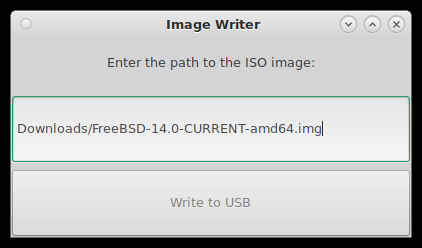
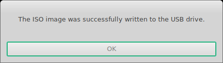

# imagewriter

A simple GUI utility for writing an ISO or IMG file to a USB drive (e.g., /dev/da0).

### Dependencies
* FreeBSD or FreeBSD-based OS
* Python 3.9 or later
* Gtk 3.0 or later

### Usage

```
python ./imagewriter.py
```

Here is an image of the initial screen.


Enter the path to the ISO or IMG file. Be sure in include the name of the file.



Once completed, the following message will appear.


