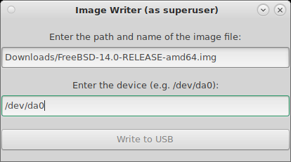

# Image Writer

A simple GUI utility for writing an ISO or IMG file to a USB drive.

### Dependencies
* FreeBSD or FreeBSD-based OS
* git
* gettext
* Gtk 3.0 or later
* intltool
* Python 3.9 or later
* py39-python-distutils-extra
* sudo

### Setup
```
git clone https://github.com/FreeBSD-Starter-Kit/imagewriter
cd imagewriter
chmod a+x imagewrite
```

### Usage

```
sudo python ./imagewriter
```

Here is an image of the initial screen.


- Enter the path and name of the ISO or IMG file.
- Enter the USB device name.
- Select "Write to USB."



Once completed, the following message will appear.


